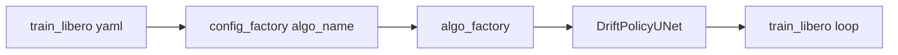

# Drift Policy（LIBERO 训练路径）架构与训练报告

本文档描述在 [train_libero.py](../robomimic/scripts/train_libero.py) 入口下使用 **Drift Policy** 时的模型结构、训练目标、默认超参数，以及优化器与学习率调度的现状与改进方向。

**配套配置**：[train_libero_drift.yaml](../robomimic/scripts/train_configs/train_libero_drift.yaml)（`algo_name: drift_policy`）。加载方式见该文件头部说明。

---

## 1. 与 `train_libero.py` 的关系

- [train_libero.py](../robomimic/scripts/train_libero.py) **不区分** diffusion / drift：通过 Hydra 读取 YAML，`config_factory(cfg_dict["algo_name"])` 再 `algo_factory(config.algo_name, ...)` 构建模型与训练循环。
- 默认 [train_libero.yaml](../robomimic/scripts/train_configs/train_libero.yaml) 为 **`algo_name: diffusion_policy`**。Drift 训练请使用 [train_libero_drift.yaml](../robomimic/scripts/train_configs/train_libero_drift.yaml)，或命令行覆盖 `algo_name=drift_policy`。
- 训练循环：DDP、`TrainUtils.run_epoch`、每 epoch 结束调用 `model.on_epoch_end(epoch)`（若配置了 LR scheduler 则在此 `step`）、日志与 checkpoint 逻辑与 Diffusion 相同。

---

## 2. Drift Policy 模型架构（与 Diffusion Policy 共用骨架）

**类**：[DriftPolicyUNet](../robomimic/algo/drift_policy.py) 继承 [DiffusionPolicyUNet](../robomimic/algo/diffusion_policy.py)，复用：

| 组件 | 作用 | 配置来源 |
|------|------|----------|
| **ObservationGroupEncoder** (`obs_encoder`) | 多模态观测编码；LIBERO 典型为低维 proprio + 两路 RGB | [train_libero.yaml](../robomimic/scripts/train_configs/train_libero.yaml) `observation.encoder`：`VisualCore` + `ResNet50Conv`（512-d、`pretrained: true`）、`ColorRandomizer` + `CropRandomizer` |
| **BatchNorm → GroupNorm** | 与 EMA 兼容 | `diffusion_policy._create_networks` 内 `replace_bn_with_gn` |
| **ConditionalUnet1D** (`noise_pred_net`) | 1D UNet，在动作序列上预测 **ε**；条件为 `global_cond = flatten(obs_features)` | `algo.unet.*`：`diffusion_step_embed_dim`, `down_dims`, `kernel_size`, `n_groups` |
| **DDIMScheduler**（或 DDPM，二选一） | 提供 `alphas_cumprod` 等，用于 **ε → x0** 的闭式变换 | `algo.ddim` / `algo.ddpm` |
| **EMA**（可选） | 对 `noise_pred_net` 做移动平均 | `algo.ema.enabled`, `algo.ema.power` |

**Drift 相对 Diffusion 的配置覆盖**（[drift_policy_config.py](../robomimic/config/drift_policy_config.py)）：

- `noise_samples = 1`（避免 Drift 里 batch 内成对距离 **O(B²)** 再乘多噪声样本）。
- `ddim.num_inference_timesteps = 1`、`ddpm.num_inference_timesteps = 1`：**推理 1 步 NFE**。

**LIBERO 动作/观测形状**（与默认 `train_libero` 一致）：`action_shapes: [1, 7]`；`seq_length: 15`，`frame_stack: 2`；`horizon`: `observation_horizon: 2`，`action_horizon: 8`，`prediction_horizon: 16`。

---

## 3. Drift 训练目标与单步计算

实现见 [DriftPolicyUNet.train_on_batch](../robomimic/algo/drift_policy.py)：

1. 调用 `super(DiffusionPolicyUNet, self).train_on_batch(...)`（走 **PolicyAlgo** 父类路径，不执行 diffusion 的噪声预测 loss）。
2. 编码观测 → `obs_cond`。
3. **固定时间步** `t = num_train_timesteps - 1`（最大噪声端）。
4. **`z ~ N(0, I)`**，形状与 `actions` 相同。
5. **Teacher（EMA 或 eval 下当前网）**：`noise_pred_ema` → `_pred_x0_from_noise` → `pred_x0_ema`，flatten 为 `gen_flat`。
6. **真实动作** flatten：`pos_flat`。
7. **Drift 场**：[compute_drift](../robomimic/algo/drift_utils.py)（核 `exp(-||x-y||/τ)`，batch 行列归一化；吸引真实、排斥同 batch 其他生成）；温度可由 [compute_adaptive_temp](../robomimic/algo/drift_utils.py) 调整；再 [clip_drift](../robomimic/algo/drift_utils.py)。
8. **目标**：`target = (gen_flat + V).detach()`（不回传到 teacher）。
9. **Student**：同一 `z`、`t`、`obs_cond` 前向 → `pred_x0_student_flat`。
10. **Loss**：`MSE(student, target)`；`backprop_for_loss(..., max_grad_norm=1.0)`；若启用 EMA 则 `ema.step`。

**要点**：训练 **不是** 标准扩散噪声回归；是在 **最大 t 对应的 x0 空间** 上，用 **mean-shift drift** 修正 teacher 的 x0，让学生拟合该目标。

---

## 4. 超参数表（默认值汇总）

### 4.1 与 `train_libero` 强相关（数据与实验）

| 类别 | 参数 | 典型值 |
|------|------|--------|
| 数据 | `train.data[].path` | `/workspace/datasets/libero/` |
| 序列 | `seq_length` | 15 |
| 序列 | `frame_stack` | 2 |
| Loader | `batch_size` | 64 |
| Loader | `num_data_workers` | 4 |
| 训练轮数 | `train.num_epochs` | 100000 |
| 每 epoch 步数 | `experiment.epoch_every_n_steps` | 100 |
| 验证 | `validation_epoch_every_n_steps` | 10 |
| 随机种子 | `train.seed` | 1 |

### 4.2 算法共用（Diffusion / Drift，`algo` 段）

| 类别 | 参数 | 默认（yaml / DiffusionPolicyConfig） |
|------|------|----------------------------------------|
| 优化 | `optim_params.policy.learning_rate.initial` | **1e-4** |
| 优化 | `optim_params.policy.learning_rate.decay_factor` | 0.1 |
| 优化 | `optim_params.policy.learning_rate.epoch_schedule` | **`[]`** |
| 优化 | `optim_params.policy.regularization.L2` | 0.0 |
| 优化器类型 | `optimizer_type`（未设时） | **adam**（[torch_utils.optimizer_from_optim_params](../robomimic/utils/torch_utils.py)） |
| Horizon | `observation_horizon` / `action_horizon` / `prediction_horizon` | 2 / 8 / 16 |
| UNet | `down_dims` | [256, 512, 1024] |
| UNet | `diffusion_step_embed_dim` | 256 |
| UNet | `kernel_size` / `n_groups` | 5 / 8 |
| EMA | `ema.enabled` / `ema.power` | true / 0.75 |
| DDIM | `num_train_timesteps` | 100 |
| DDIM | `beta_schedule` / `clip_sample` / `prediction_type` | squaredcos_cap_v2 / true / epsilon |
| Diffusion-only（默认 yaml） | `noise_samples` | 8（**Drift 配置类强制为 1**） |

### 4.3 Drift 专用（[drift_policy_config.py](../robomimic/config/drift_policy_config.py)，可在 YAML `algo.drift` 覆盖）

| 参数 | 默认值 |
|------|--------|
| `algo.drift.temp` | 0.05 |
| `algo.drift.max_drift` | 0.1 |
| `algo.drift.use_adaptive_temp` | true |
| 梯度裁剪（代码硬编码） | `max_grad_norm=1.0` |

### 4.4 观测 / 图像（LIBERO）

| 参数 | 值 |
|------|-----|
| `observation.image_dim` | [128, 128] |
| RGB backbone | ResNet50Conv, `feature_dimension` 512 |
| 增广 | Crop 116×116, ColorRandomizer |

---

## 5. Optimizer 与 LR Schedule：现状

- **优化器**：`torch.optim.Adam`，`lr = optim_params.policy.learning_rate.initial`，`weight_decay = L2`（当前为 0）。
- **学习率调度**：[lr_scheduler_from_optim_params](../robomimic/utils/torch_utils.py) 仅当 **`epoch_schedule` 非空** 时创建 scheduler；否则为 **`None`**。
- **默认**：`epoch_schedule: []` → **全程恒定 1e-4**，无 warmup、无 cosine、无 multistep 衰减。
- **step 时机**：[Algo.on_epoch_end](../robomimic/algo/algo.py) 对每个非空 scheduler 调用 `step()`（**按 epoch**，非按 iteration）。

---

## 6. 可改进方向（Drift + 大 backbone）

1. **显式 LR 衰减**：在 YAML 中设置 `algo.optim_params.policy.learning_rate.epoch_schedule` 与 `decay_factor`。当前实现仅支持 **MultiStepLR** 与 **LinearLR**（单终点）；**CosineAnnealing** 或 **warmup** 需扩展 [torch_utils.lr_scheduler_from_optim_params](../robomimic/utils/torch_utils.py) 或自定义 scheduler。
2. **Warmup**：DDP 下有效 batch = `batch_size × world_size`，常用线性 warmup + cosine；可缓解训练初期梯度过大。
3. **AdamW + 分组 weight decay**：可对 backbone 使用 AdamW 并对 bias/norm 关闭 decay；**分组 LR**（backbone 小 LR、UNet 大 LR）需改 `_create_optimizers` 或配置结构。
4. **按有效 batch 缩放初始 LR**：改变 `batch_size` 或 GPU 数时，可尝试 `lr_0` 与 effective batch 线性缩放（配合 warmup）。
5. **Drift 超参**：`temp` / `max_drift` / `use_adaptive_temp`、`ema.power` 与 LR/warmup 联合调节。
6. **梯度裁剪**：当前 `max_grad_norm=1.0`；调大 LR 时可对比 0.5 / 2.0 或按子模块裁剪（需改代码）。

---

## 7. 相关文件索引

| 文件 | 说明 |
|------|------|
| [train_libero.py](../robomimic/scripts/train_libero.py) | LIBERO DDP 训练入口 |
| [train_libero.yaml](../robomimic/scripts/train_configs/train_libero.yaml) | 默认 Diffusion 配置 |
| [train_libero_drift.yaml](../robomimic/scripts/train_configs/train_libero_drift.yaml) | Drift 专用 Hydra 配置 |
| [drift_policy.py](../robomimic/algo/drift_policy.py) | Drift 训练与日志 |
| [drift_utils.py](../robomimic/algo/drift_utils.py) | Mean-shift drift 与温度 |
| [drift_policy_config.py](../robomimic/config/drift_policy_config.py) | Drift 默认算法配置 |
| [diffusion_policy.py](../robomimic/algo/diffusion_policy.py) | UNet、调度器、EMA 骨架 |
